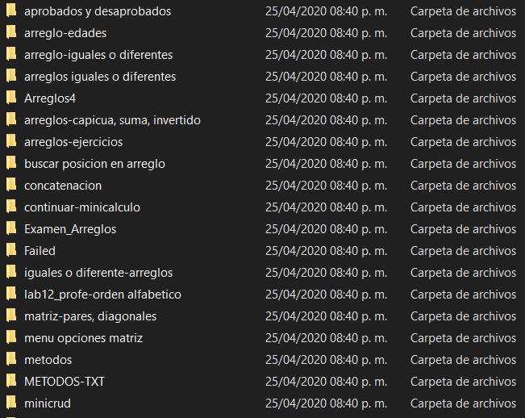
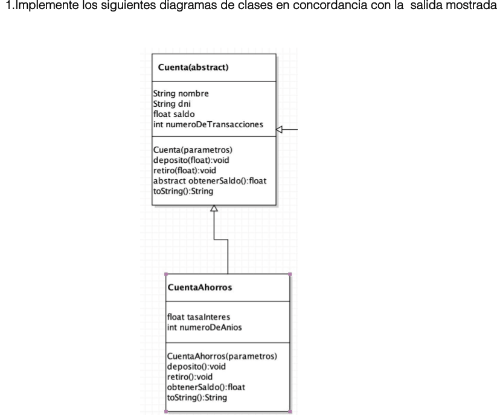
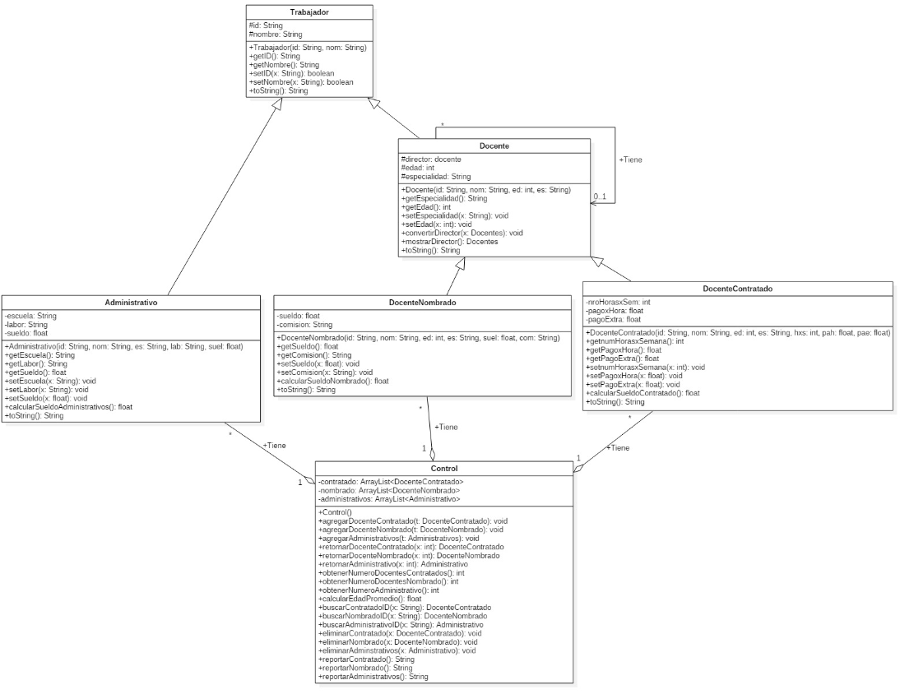
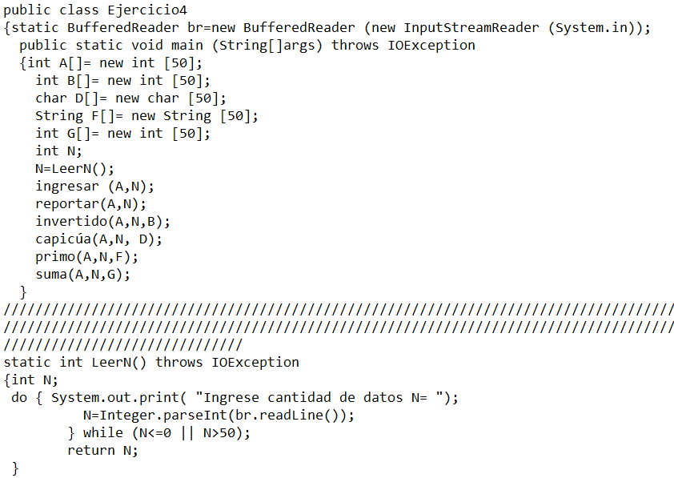
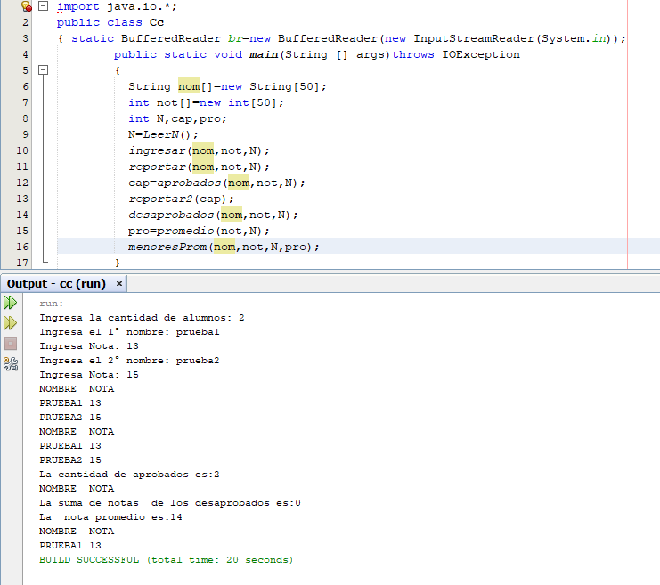
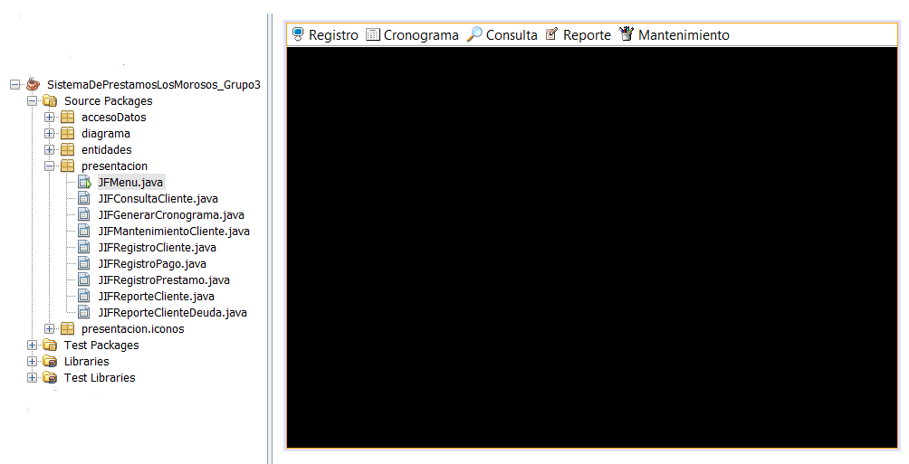
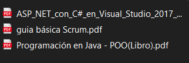

# EJERCICIOS RESUELTOS DE PROGRAMACIÓN:
## Carpetas:
* Estructura de datos:
    * Difernetes estructuras de organización de datos.     
* Fundamentos de programmación JAVA
    * Ejercicios básicos de programación en Java.
    * Carpeta **Failed** tiene ejercicios que no se ejecutan correctamente o incompletos.
* Libros:
    * Libro de POO.
    * Libro de ASP.NET.
    * Guía básica de SCRUM.
* POO (Programación Orientada a Objetos):
    * Ejercicios básicos de Programación Orientada a Objetos (POO) codificado.
    * Diagramas UML.
    * Carpeta **Failed** tiene ejercicios que no se ejecutan correctamente o incompletos.
    * Un proyecto final. 
* Pruebas Python:
    * Ejercicios básicos de Python.
    * Carpeta **Failed** tiene ejercicios que no se ejecutan correctamente o incompletos.
## Contenido:
#### Carpeta del código:
Los códigos estarán en sus respectivas carpetas (proyectos). Algunos proyectos tienen varios ejercicios.
* Imagen de carpetas en fundamentos de programación JAVA:

#### Algunas instrucciones de los ejercicios:
Algunos ejercicios vienen con sus instrucciones (Descrito o solo diagrama UML).

#### Diagrama UML:
La mayoría de ejercicios que están dentro de un proyecto tienen su propio diagrama UML.

#### Archivo txt con los ejercicios: 
Los archivos txt (código del ejercicio) pueden ubicarlos dentro de una carpeta **src** que a su vez está dentro de las carpetas de trabajos.

#### Código de ejercicio ejecutado:
Pueden descargar los proyectos y ejecutarlos para que puedan ver su funcionamiento.

#### Pequeño proyecto de POO:
Un pequeño proyecto de préstamos. Tiene sus entidades, bd (arrays), íconos, diagramas 

#### Carpeta Failed: 
Todos tienen una carpeta con el nombre **failed**. Ahí están los archivos que no se ejecuntan como se esperaba, están mal o están incompletos.

#### Libros: 
Encontrarás 2 libros (una de JAVA y el otro de ASP.NET) y una guía básica de Scrum.
